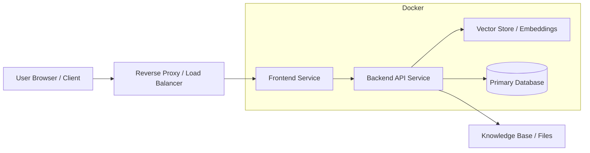

# Architecture Diagram

```mermaid
graph LR
  Browser[User Browser / Client]
  LB[Reverse Proxy / Load Balancer]
  FE[Frontend Service]
  BE[Backend API Service]
  VS[Vector Store / Embeddings]
  DB[(Primary Database)]
  KB[Knowledge Base / Files]

  Browser --> LB --> FE
  FE --> BE
  BE --> VS
  BE --> DB
  BE --> KB

  subgraph Docker
    FE
    BE
    VS
    DB
  end
```

Notes:
- The frontend communicates with the backend over HTTP(S).
- The backend queries the vector store for semantic search and the primary database for application data.
 