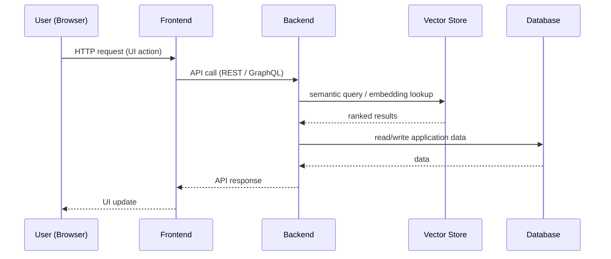

# Request Flow

```mermaid
sequenceDiagram
  participant U as User (Browser)
  participant FE as Frontend
  participant BE as Backend
  participant VS as Vector Store
  participant DB as Database

  U->>FE: HTTP request (UI action)
  FE->>BE: API call (REST / GraphQL)
  BE->>VS: semantic query / embedding lookup
  VS-->>BE: ranked results
  BE->>DB: read/write application data
  DB-->>BE: data
  BE-->>FE: API response
  FE-->>U: UI update
```

This sequence shows a typical user interaction that triggers a backend semantic search and data access.
